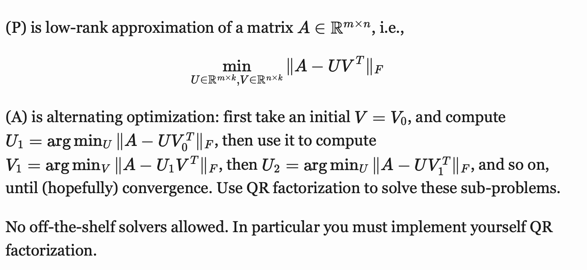

# Project of Computational Mathematics for Learning and Data Analysis

(P1) are any optimization or numerical analysis problems for which solution algorithms can be implemented using the techniques we have seen in the course.

(A1) are one algorithm for solving the problems (P1) that have been seen in the course, or are at least based on the same conceptual tools.

